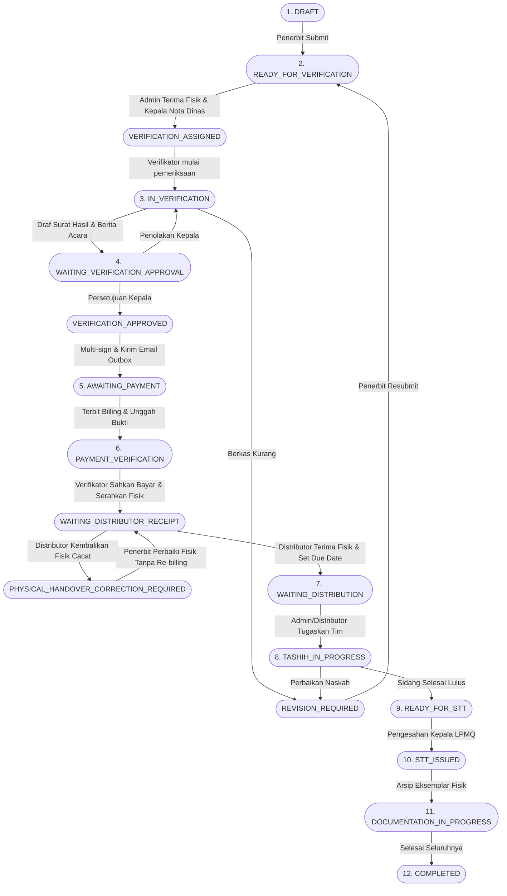

# Spesifikasi Kontrak API & Arsitektur Layanan — LPMQ Tashih Hub

> **Status Dokumen**: Resmi (Live Implementation Reference).  
> **Versi Standar**: SOP Pentashihan Mushaf Al-Qur'an Kemenag RI v2.2.  
> **Base URL**: `/api/v1`  
> **Otentikasi**: HTTP Bearer Token (`Authorization: Bearer <jwt-token>`).

Dokumen ini merupakan referensi tunggal kontrak REST API dan arsitektur alur kerja backend LPMQ Tashih Hub. Seluruh format data, skema validasi Zod, kebijakan otorisasi berbasis peran (RBAC), serta mesin status (*state machine*) di bawah ini telah terpasang dan teruji secara penuh di backend.

---

## 1. Standar REST API & Respon Envelope

### 1.1 Format Respon Sukses (HTTP 200 / 201)
Semua respon sukses dibungkus dalam envelope JSON konsisten:
```json
{
  "success": true,
  "message": "Operasi berhasil dijalankan.",
  "data": { ... }
}
```

### 1.2 Format Respon Kesalahan (HTTP 400, 401, 403, 404, 409, 422, 500)
Respon kesalahan ditangkap oleh `error.middleware.js` dengan format:
```json
{
  "success": false,
  "message": "Validasi input gagal.",
  "errors": [
    {
      "field": "name",
      "message": "Nama kategori wajib diisi minimal 3 karakter."
    }
  ]
}
```

### 1.3 Kode Status HTTP Utama
| Kode HTTP | Makna & Penggunaan |
|---|---|
| `200 OK` | Permintaan pembacaan atau pembaruan data berhasil. |
| `201 Created` | Sumber daya baru (pengajuan, tagihan, berkas, dokumen) berhasil dibuat. |
| `400 Bad Request` | Payload tidak valid secara skema Zod atau pelanggaran logika dasar. |
| `401 Unauthorized` | Token JWT tidak disertakan atau telah kedaluwarsa. |
| `403 Forbidden` | Peran pengguna (Role) tidak memiliki izin untuk rute terkait. |
| `404 Not Found` | Data atau berkas privat tidak ditemukan di pangkalan data/storage. |
| `409 Conflict` | Konflik status pada alur kerja (misal: transisi status ilegal atau duplikasi nomor). |
| `413 Payload Too Large` | Ukuran berkas unggahan melebihi batas (maksimum 10 MiB). |
| `422 Unprocessable Entity` | Data tidak dapat diproses (contoh: font PDF belum mendukung karakter tertentu). |

---

## 2. Matriks Peran Pengguna (RBAC)

Sistem menggunakan enum peran `Role` yang tersimpan pada tabel `UserRole`:

| Kode Role | Nama Peran | Hak Akses Utama |
|---|---|---|
| `SUPERADMIN` | Administrator Sistem | Akses penuh ke seluruh modul, konfigurasi master data CRUD, dan audit log. |
| `ADMIN_PENERBIT` | Penerbit / Pemohon | Portal Penerbit: membuat draft, upload naskah, submit pengajuan, konfirmasi billing. |
| `ADMIN` | Staf TU / Layanan | Penerimaan master fisik permohonan (intake), penugasan tim sidang pentashihan, antrean FIFO. |
| `VERIFIKATOR` | Verifikator Berkas | Memeriksa berkas permohonan, menyusun draf surat & BA verifikasi, verifikasi pembayaran PNBP, serah-terima fisik ke distributor. |
| `DISTRIBUTOR` | Koordinator Distribusi | Menerima serah-terima fisik (menetapkan `tashih_due_at`), mengelola beban kerja tim sidang (SK), review hasil sidang. |
| `PENTASHIH` | Anggota Tim Sidang | Melakukan sidang pentashihan mushaf, mencatat koreksi lafazh, submit review. |
| `DOKUMENTATOR` | Dokumentator Hasil | Menyusun draf berita acara tashih, mencatat penyerahan eksemplar fisik master. |
| `KEPALA_LPMQ` | Kepala LPMQ | Menerbitkan Nota Dinas & penugasan verifikator, menyetujui dan menandatangani dokumen verifikasi, menandatangani Surat Tanda Tashih. |

---

## 3. Modul Autentikasi (`/auth`)

### 3.1 Masuk Sistem (Login)
- **Rute**: `POST /api/v1/auth/login`
- **Akses**: Publik
- **Payload**:
  ```json
  {
    "email": "penerbit@mushafnusantara.com",
    "password": "Password123!"
  }
  ```
- **Respon Data**:
  ```json
  {
    "token": "eyJhbGciOiJIUzI1NiIsInR5cCI6IkpXVCJ9...",
    "user": {
      "id": "uuid",
      "name": "PT Mushaf Nusantara",
      "email": "penerbit@mushafnusantara.com",
      "roles": ["ADMIN_PENERBIT"],
      "publisher": { "id": "uuid", "name": "PT Mushaf Nusantara" }
    }
  }
  ```

### 3.2 Pendaftaran Akun Penerbit Baru
- **Rute**: `POST /api/v1/auth/register-publisher`
- **Akses**: Publik
- **Payload**:
  ```json
  {
    "publisher_name": "Penerbit Al-Huda Prima",
    "email": "kontak@alhudaprima.id",
    "phone": "081234567890",
    "address": "Jl. Percetakan No. 45, Jakarta Pusat",
    "password": "Password123!"
  }
  ```

---

## 4. Modul Master Data (`/master`)

Modul master data menyediakan pembacaan publik/terotentikasi serta operasi pengelolaan penuh (**CRUD**) dengan proteksi role `SUPERADMIN`.

### 4.1 Kategori Mushaf (`/master/categories`)
- `GET /categories` — Daftar semua kategori aktif.
- `GET /categories/:id` — Detail kategori berdasarkan ID atau slug.
- `POST /categories` — Tambah kategori baru (`SUPERADMIN`).
  ```json
  {
    "name": "Mushaf Standar Indonesia Braille",
    "slug": "mushaf-standar-indonesia-braille",
    "description": "Mushaf Al-Qur'an khusus tunanetra dengan standar Braille Kemenag RI",
    "is_active": true
  }
  ```
- `PUT /categories/:id` — Perbarui kategori (`SUPERADMIN`).
- `DELETE /categories/:id` — Hapus kategori (`SUPERADMIN`).

### 4.2 Jenis Layanan & Tarif (`/master/service-types`)
- `GET /service-types` — Daftar profil layanan pentashihan aktif.
- `GET /service-types/:id` — Detail jenis layanan.
- `POST /service-types` — Tambah jenis layanan baru (`SUPERADMIN`).
  ```json
  {
    "code": "PRINT_30_JUZ",
    "name": "Pentashihan Mushaf Cetak 30 Juz",
    "base_fee": 1500000,
    "sla_days": 15,
    "is_active": true
  }
  ```
- `PUT /service-types/:id` — Perbarui jenis layanan (`SUPERADMIN`).
- `DELETE /service-types/:id` — Hapus jenis layanan (`SUPERADMIN`).

### 4.3 Layanan Tambahan / Addon (`/master/addons`)
- `GET /addons` — Daftar layanan tambahan aktif (misal: Terjemah, Tajwid Warna, Suplemen).
- `GET /addons/:id` — Detail addon.
- `POST /addons` — Tambah addon baru (`SUPERADMIN`).
  ```json
  {
    "code": "TAJWID_WARNA",
    "name": "Pentashihan Kaidah Tajwid Berwarna",
    "addon_fee": 500000,
    "additional_sla_days": 3,
    "is_active": true
  }
  ```
- `PUT /addons/:id` — Perbarui addon (`SUPERADMIN`).
- `DELETE /addons/:id` — Hapus addon (`SUPERADMIN`).

### 4.4 Tim Distribusi & SK (`/master/distribution-teams`)
- `GET /distribution-teams` — Daftar tim pentashihan aktif beserta SK dan daftar anggota pentashih.

### 4.5 Kalender Hari Kerja & SLA (`/master/working-days`)
- `PUT /master/working-days` (`SUPERADMIN`) — Menyinkronkan daftar hari kerja dan hari libur resmi nasional untuk kalkulasi SLA berbasis kalender kerja instansi.

---

## 5. Modul Registrasi & Pengelolaan Naskah (`/registrations`)

### 5.1 Alur Pengajuan Digital
1. `POST /registrations` (`ADMIN_PENERBIT`): Membuat draf registrasi pengajuan baru (status awal: `DRAFT`).
2. `POST /uploads` (`ADMIN_PENERBIT`, `VERIFIKATOR`, `DOKUMENTATOR`): Mengunggah berkas biner naskah mentah (PDF/PNG/JPEG, batas 10 MiB). Menghasilkan `id` berkas privat.
3. `POST /registrations/:id/manuscripts`: Menautkan berkas privat yang telah diunggah ke pengajuan (`type`: `COVER`, `SURAH_SAMPEL`, `JUZ_LENGKAP`, dll).
4. `POST /registrations/:id/submit` (`ADMIN_PENERBIT`): Mengunci formulir dan mengirimkan pengajuan ke LPMQ (transisi dari `DRAFT` ke `READY_FOR_VERIFICATION`).

### 5.2 Intake Master Fisik
1. `PUT /registrations/:id/physical-master` (`ADMIN_PENERBIT`): Penerbit mendeklarasikan pengiriman berkas master fisik cetak A4 dijilid per juz (jilid 1–30).
2. `POST /registrations/:id/physical-master/receive` (`ADMIN`): Staf TU / Layanan menerima dan memeriksa kelengkapan fisik di loket LPMQ. Menolak `KEPALA_LPMQ` (`403`).

---

## 6. Alur Layanan SOP v2.2 (Siklus Hidup Pentashihan)

### Tahap 1: Verifikasi Berkas Permohonan (Live)
- **Aktor**: `ADMIN`, `KEPALA_LPMQ`, `VERIFIKATOR`
- **Alur Status**: `READY_FOR_VERIFICATION` → `VERIFICATION_ASSIGNED` → `IN_VERIFICATION` → `WAITING_VERIFICATION_APPROVAL` → `VERIFICATION_APPROVED` → `AWAITING_PAYMENT` (atau `REVISION_REQUIRED`).
- **Endpoint**:
  - `POST /registrations/:id/verification-assignments` (`KEPALA_LPMQ`): Menerbitkan **Nota Dinas Verifikasi** (`NOTA_DINAS_VERIFIKASI`) dan menugaskan Verifikator secara atomik dengan perhitungan tenggat tepat 2 hari kerja kalender `Asia/Jakarta`.
  - `POST /verification-documents` (`VERIFIKATOR`): Menyusun draf **Surat Pemberitahuan Hasil Verifikasi** (`SURAT_HASIL_VERIFIKASI`) dan **Berita Acara Verifikasi** (`BERITA_ACARA_VERIFIKASI`).
  - `POST /verification-documents/:id/submit` (`VERIFIKATOR`): Mengajukan draf ke Kepala LPMQ (`WAITING_APPROVAL`).
  - `POST /verification-documents/:id/approve` (`KEPALA_LPMQ`): Menyetujui draf dokumen dan menginisialisasi relasi `VerificationDocumentSignatory`.
  - `POST /verification-documents/:id/sign` (`VERIFIKATOR`, `KEPALA_LPMQ`): Penandatanganan digital berjenjang (Verifikator urutan 1 untuk Berita Acara; Kepala LPMQ urutan 1 untuk Surat Hasil & urutan 2 untuk Berita Acara).
  - `POST /verification-documents/:id/send` (`VERIFIKATOR`): Mengirim surat hasil verifikasi ke penerbit secara idempoten via `EmailOutbox`.
  - `POST /verification-documents/:id/retry-email` (`VERIFIKATOR`, `KEPALA_LPMQ`): Mencoba ulang pengiriman email yang gagal (`EMAIL_FAILED`).

### Tahap 2: Billing, Pembayaran PNBP & Serah-Terima Fisik
- **Endpoint**:
  - `POST /registrations/:id/payments` (`VERIFIKATOR`): Menerbitkan kode billing pembayaran PNBP berstatus `UNPAID`. Tarif diambil secara deterministik dari `fee_sla_snapshot`.
  - `POST /payments/:id/confirm` (`ADMIN_PENERBIT`): Penerbit mengunggah bukti setor bank / NTPN. Status registrasi berpindah ke `PAYMENT_VERIFICATION`.
  - `PATCH /payments/:id/verify` (`VERIFIKATOR` penugasan): Memvalidasi bukti bayar (khusus verifikator yang ditugaskan). Catatan bayar menjadi `VERIFIED`.
  - `POST /registrations/:id/handover/submit` (`VERIFIKATOR` penugasan): Menyerahkan master fisik ke loket Distributor. Status beralih ke `WAITING_DISTRIBUTOR_RECEIPT`.
  - `POST /registrations/:id/handover/confirm` (`DISTRIBUTOR`): Distributor menerima fisik dengan menetapkan waktu `tashih_due_at` masa depan. Status beralih ke `WAITING_DISTRIBUTION`.
  - `POST /registrations/:id/handover/return` (`DISTRIBUTOR`): Mengembalikan fisik yang cacat ke penerbit. Status beralih ke `PHYSICAL_HANDOVER_CORRECTION_REQUIRED` (pembayaran tetap `VERIFIED` tanpa penerbitan tagihan ulang).

### Tahap 3: Distribusi Sidang & Penugasan Tim
- **Aktor**: `ADMIN`, `DISTRIBUTOR`
- **Endpoint**:
  - `POST /registrations/:id/assignments`: Membentuk penugasan anggota tim pentashih berdasarkan SK resmi dari antrean FIFO. Menghitung tanggal tenggat (`due_at`) berbasis kalender kerja aktif.
  - Registrasi berpindah status ke `TASHIH_IN_PROGRESS`.

### Tahap 4: Sidang Pentashihan Naskah
- **Aktor**: `PENTASHIH`, `DISTRIBUTOR`
- **Endpoint**:
  - `POST /assignments/:id/review` (`PENTASHIH`): Mencatat telaah sidang (`PASSED`, `REVISION_REQUIRED`, atau `REJECTED`) beserta catatan koreksi lafazh/tanda baca.
  - `POST /registrations/:id/distribution-review` (`DISTRIBUTOR`): Distributor mengompilasi hasil telaah seluruh anggota tim:
    * Jika semua lulus → status beralih ke `READY_FOR_STT`.
    * Jika butuh perbaikan → status kembali ke penerbit (`REVISION_REQUIRED`).

### Tahap 5: Pengesahan Berita Acara & Surat Tanda Tashih (STT)
- **Aktor**: `DISTRIBUTOR`, `DOKUMENTATOR`, `KEPALA_LPMQ`
- **Endpoint**:
  - `POST /registrations/:id/official-documents`: Menghasilkan draf dokumen resmi (`BERITA_ACARA_TASHIH` atau `SURAT_TANDA_TASHIH`) dengan snapshot data terkunci.
  - `POST /official-documents/:id/sign` (`KEPALA_LPMQ`): Pengesahan digital dokumen oleh Kepala LPMQ. Status registrasi beralih ke `STT_ISSUED`.
  - `GET /official-documents/:id/pdf`: Mengunduh dokumen PDF resmi.
  - `GET /public/verify-document/:token`: Validasi keabsahan QR code STT secara publik.

### Tahap 6: Dokumentasi Master & Penyelesaian
- **Aktor**: `DOKUMENTATOR`
- **Alur Status**: `STT_ISSUED` → `DOCUMENTATION_IN_PROGRESS` → `COMPLETED`.
- Dokumentator memverifikasi serah terima eksemplar fisik mushaf yang telah dicetak untuk diarsipkan pada perpustakaan LPMQ.

---

## 7. Diagram Mesin Status (*State Machine*)



---

## 8. Ringkasan Keamanan & Kepatuhan SOP

1. **Integritas Status Terpusat**: Seluruh transisi status registrasi dikawal oleh fungsi terpusat `transitionStatus()` dan diverifikasi terhadap `TRANSITION_POLICY`. Manipulasi status secara langsung ditolak pada layer service.
2. **Perlindungan Berkas Privat Tanpa Token URL**: Berkas mushaf disimpan pada storage privat; pengaksesan melalui `/uploads/:id` mewajibkan otentikasi header `Authorization: Bearer <token>` dan verifikasi kepemilikan naskah/surat tugas aktif, serta dilindungi respons header `Cache-Control: private, no-store`. Token di query parameter URL tidak diizinkan.
3. **Audit Trail Digital & Outbox Idempoten**: Seluruh mutasi data penting dicatat otomatis pada tabel `AuditLog`. Pengiriman email hasil verifikasi menggunakan pola `EmailOutbox` dengan idempotency key dan mekanisme retry berstatus andal.
