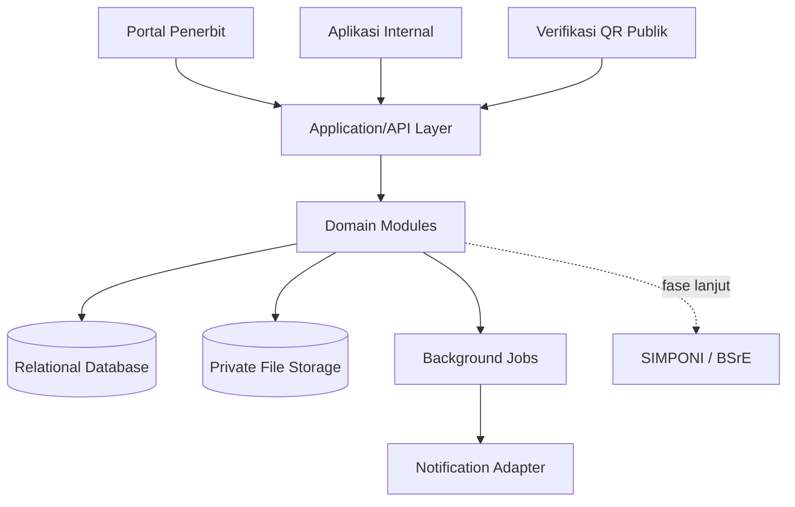
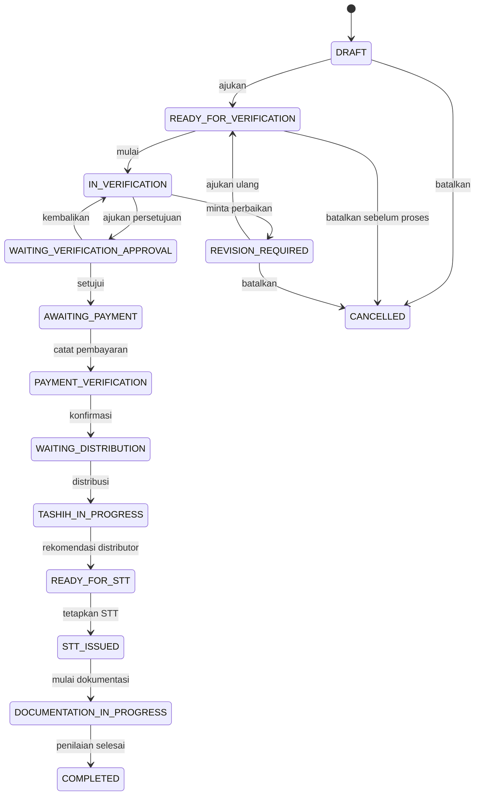

# Design Baseline

## 1. Konteks produk

Sistem melayani dua kanal:

1. Portal penerbit untuk data badan hukum, pengajuan, perbaikan, pelacakan, pembayaran, dan dokumen.
2. Aplikasi internal untuk verifikasi, distribusi, pentashihan, dokumentasi, penetapan, laporan, dan audit.

Keduanya berbagi backend dan database. Pemisahan kanal tidak boleh menyebabkan duplikasi aturan bisnis.

## 2. Arsitektur logis

## 3. Modul domain

| Modul | Tanggung jawab |
|---|---|
| Identity & Access | Pengguna, role, permission, session, akun aktif |
| Publisher | Profil penerbit dan dokumen badan hukum |
| Master Data | Kategori, layanan, SLA, add-on, tarif, kalender, Tim Distribusi |
| Registration | Pengajuan baru/perpanjangan, metadata, sampel naskah, penerimaan master fisik |
| Verification | Assignment verifikator, checklist, BA, persetujuan Kepala LPMQ, Tugas Saya |
| Billing | Snapshot kalkulasi, billing, bukti pembayaran, status rekonsiliasi |
| Distribution | Tim berbasis SK, anggota, assignment tahap awal/perbaikan/dumi, reviu distributor |
| Tashih | Progres dan rekomendasi per pentashih/pembaca naskah |
| Documentation | STT, checklist, eksemplar/N/A, tanda terima, penilaian, versi, masa berlaku |
| Public Verification | Token QR, metadata publik, status aktif/kedaluwarsa |
| Audit & Notification | Audit append-only dan notifikasi pengguna |

## 4. Dokumen dan file

### Input penerbit

- Cover.
- Halaman Al-Qur'an 1–5 sebagai sampel/penanda naskah.
- Dokumen badan hukum dan pembayaran sesuai tahapnya.

### Keluaran proses

Berita Acara Tashih bukan syarat upload awal. Dokumen ini dibentuk setelah proses tashih dan minimal berisi:

- identitas naskah;
- rincian komponen, tarif, dan durasi pengerjaan;
- matriks distribusi dan progres tahapan kerja;
- catatan serta rekomendasi verifikator;
- tanda tangan verifikator/pejabat sesuai SOP;
- tanda tangan verifikator sesuai format resmi.

Surat Tanda Tashih ditetapkan oleh Kepala LPMQ setelah distributor mereviu rekomendasi pentashih/pembaca naskah. Mekanisme delegasi masih keputusan terbuka.

## 5. Model data minimum

Entitas inti:

- `users`, `roles`, `user_roles`
- `publishers`, `publisher_documents`
- `mushaf_categories`, `service_types`
- `service_addons`, `registration_addons`
- `working_days`
- `registrations`, `manuscript_files`, `physical_master_receipts`, `status_histories`
- `verification_assignments`
- `distribution_teams`, `team_members`
- `assignments`, `assignment_members`, `tashih_reviews`
- `payment_records`
- `documentation_items`, `official_documents`, `document_signatories`, `printed_mushaf_receipts`, `archive_distributions`
- `notifications`, `audit_logs`

Constraint penting:

- Nomor pengajuan dan nomor dokumen unik.
- `previous_registration_id` nullable, tidak boleh menunjuk dirinya sendiri, dan wajib untuk tipe perpanjangan.
- Master tarif/SLA menggunakan `effective_from`/`effective_to` dan tidak ditimpa.
- Snapshot biaya/SLA pada transaksi immutable setelah submit.
- Satu versi dokumen resmi aktif; versi lama tetap tersimpan.
- Semua foreign key transaksi menggunakan restrict/soft delete sesuai kebijakan, bukan cascade delete membabi buta.

## 6. Alur status

## 7. Keamanan minimum

- Default deny RBAC dan policy per resource/penerbit.
- Scope setiap query portal menggunakan publisher terautentikasi.
- UUID/ULID bukan pengganti authorization check.
- File di private storage; unduhan memakai authorization dan URL sementara.
- Validasi MIME melalui isi file, ukuran, ekstensi, checksum, nama aman, dan scanning sesuai infrastruktur.
- Token QR acak berentropi tinggi, tidak berurutan, dapat dirotasi/dicabut, dan diberi rate limit.
- Endpoint QR hanya menampilkan judul, penerbit, nomor Surat Tanda Tashih, status, deskripsi, dan cover yang diizinkan.
- Audit log append-only untuk login sensitif, permission, status, assignment, tarif, pembayaran, dan dokumen.
- Secret hanya melalui secret manager/environment dan tidak pernah masuk Git/log.

## 8. Integrasi eksternal

Gunakan port/adapter:

- `BillingGateway` untuk SIMPONI.
- `DigitalSignatureProvider` untuk BSrE.
- `NotificationChannel` untuk email/kanal lain.
- `FileStorage` untuk object storage.

MVP memakai adapter manual/local. Kontrak adapter harus dapat diuji tanpa akses layanan eksternal.

## 9. Keputusan terbuka

| ID | Keputusan | Batas waktu |
|---|---|---|
| ADR-001 | Stack backend, UI, database, queue, dan storage | Sebelum scaffold Sprint 0 |
| ADR-002 | Sumber SOP/domain kanonik dan effective date | Setelah rapat stakeholder |
| ADR-003 | Delegasi penetapan saat Kepala LPMQ berhalangan | Sebelum Sprint 5 |
| ADR-004 | Format dan penanda tangan final Berita Acara Tashih | Sebelum Sprint 4 |
| ADR-005 | Aturan pembatalan setelah billing/pembayaran | Sebelum Sprint 3 |
| ADR-006 | Retensi, backup, klasifikasi data, dan antivirus | Sebelum deployment staging |
| ADR-007 | Akun/antrean PusdokQ dan arsiparis atau hanya tujuan serah terima | Sebelum Sprint 5 |
