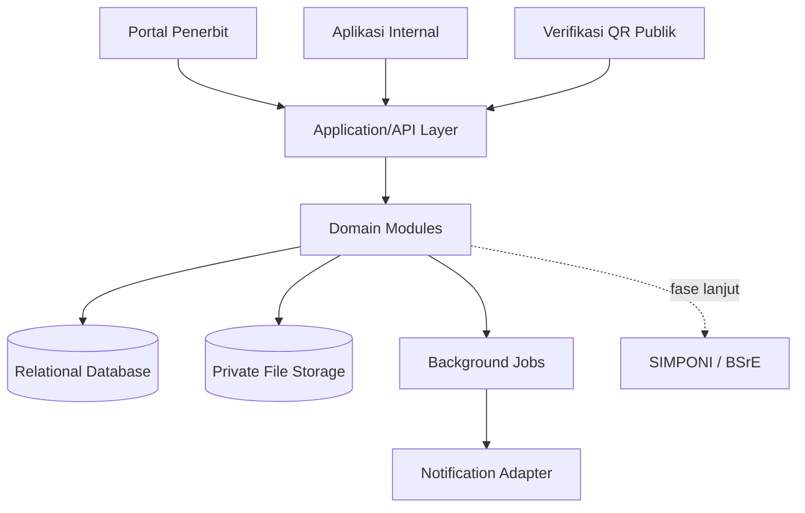
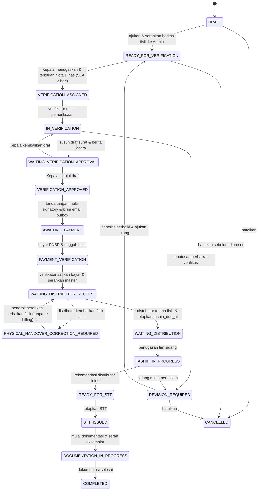

# Design Baseline

## 1. Konteks produk

Sistem melayani dua kanal:

1. Portal penerbit untuk data badan hukum, pengajuan, perbaikan, pelacakan, pembayaran, dan dokumen.
2. Aplikasi internal untuk verifikasi, distribusi, pentashihan, dokumentasi, penetapan, laporan, dan audit.

Keduanya berbagi backend dan database. Pemisahan kanal tidak boleh menyebabkan duplikasi aturan bisnis.

## 2. Arsitektur logis

## 3. Modul domain

| Modul | Tanggung jawab |
|---|---|
| Identity & Access | Pengguna, role (`SUPERADMIN`, `ADMIN_PENERBIT`, `HELPER_ADMIN`, `VERIFIKATOR`, `DISTRIBUTOR`, `PENTASHIH`, `DOKUMENTATOR`, `KEPALA_LPMQ`), session, akun aktif |
| Publisher | Profil penerbit dan dokumen badan hukum |
| Master Data | Kategori, layanan, SLA, add-on, tarif, kalender kerja, Tim Distribusi |
| Registration | Pengajuan baru/perpanjangan, metadata, sampel naskah, penerimaan master fisik oleh `HELPER_ADMIN` |
| Verification | Assignment & Nota Dinas atomik Kepala LPMQ (SLA 2 hari kerja), checklist berkas, draf Surat Hasil & Berita Acara Verifikasi, tanda tangan multi-signatory, outbox email idempoten, Tugas Saya |
| Billing | Snapshot kalkulasi, billing PNBP, bukti pembayaran, verifikasi bayar oleh Verifikator penugasan |
| Distribution | Handover fisik ke distributor, penetapan `tashih_due_at`, koreksi fisik cacat (`PHYSICAL_HANDOVER_CORRECTION_REQUIRED`), tim berbasis SK, anggota, assignment tahap awal/perbaikan/dumi, reviu distributor |
| Tashih | Progres dan rekomendasi per pentashih/pembaca naskah |
| Documentation | STT, checklist, eksemplar/N/A, tanda terima, penilaian, versi, masa berlaku |
| Public Verification | Token QR, metadata publik, status aktif/kedaluwarsa |
| Audit & Notification | Audit append-only dan antrean pengiriman email outbox idempoten |

## 4. Dokumen dan file

### Input penerbit

- Cover.
- Halaman Al-Qur'an 1–5 sebagai sampel/penanda naskah.
- Master fisik cetak A4 dijilid per juz diserahkan ke loket LPMQ (diterima oleh `HELPER_ADMIN`).
- Dokumen badan hukum dan pembayaran sesuai tahapnya.

### Keluaran proses

Dokumen resmi dipisahkan secara tegas dan berjenjang:

1. **Nota Dinas Verifikasi (`NOTA_DINAS_VERIFIKASI`)**: Diterbitkan oleh Kepala LPMQ saat menugaskan verifikator.
2. **Surat Pemberitahuan Hasil Verifikasi (`SURAT_HASIL_VERIFIKASI`)**: Diterbitkan oleh Kepala LPMQ dan dikirimkan ke penerbit via email resmi berisi keputusan Lolos/Perlu Perbaikan.
3. **Berita Acara Verifikasi (`BERITA_ACARA_VERIFIKASI`)**: Dokumen internal hasil sidang verifikasi yang ditandatangani berjenjang oleh Verifikator lalu Kepala LPMQ.
4. **Berita Acara Tashih (`BERITA_ACARA_TASHIH`)**: Dibentuk setelah proses sidang tashih selesai oleh tim pentashih/distributor.
5. **Surat Tanda Tashih (`SURAT_TANDA_TASHIH`)**: Ditetapkan oleh Kepala LPMQ setelah seluruh rekomendasi pentashih dan distributor tuntas.

## 5. Model data minimum

Entitas inti:

- `users`, `roles`, `user_roles`
- `publishers`, `publisher_documents`
- `mushaf_categories`, `service_types`
- `service_addons`, `registration_addons`
- `working_days`
- `registrations`, `manuscript_files`, `physical_master_receipts`, `status_histories`
- `verification_assignments`, `verification_documents`, `verification_document_signatories`
- `email_outbox`
- `distribution_teams`, `team_members`
- `assignments`, `assignment_members`, `tashih_reviews`
- `payment_records`
- `documentation_items`, `official_documents`, `document_signatories`, `printed_mushaf_receipts`, `archive_distributions`
- `notifications`, `audit_logs`

Constraint penting:

- Nomor pengajuan dan nomor dokumen unik.
- `previous_registration_id` nullable, tidak boleh menunjuk dirinya sendiri, dan wajib untuk tipe perpanjangan.
- Master tarif/SLA menggunakan `effective_from`/`effective_to` dan tidak ditimpa.
- Snapshot biaya/SLA pada transaksi immutable setelah submit.
- Satu versi dokumen resmi aktif; versi lama tetap tersimpan.
- Semua foreign key transaksi menggunakan restrict/soft delete sesuai kebijakan, bukan cascade delete membabi buta.

## 6. Alur status

## 7. Keamanan minimum

- Default deny RBAC dan policy per resource/penerbit.
- Scope setiap query portal menggunakan publisher terautentikasi.
- UUID/ULID bukan pengganti authorization check.
- File di private storage; unduhan mewajibkan header `Authorization: Bearer <token>` dan dilindungi `Cache-Control: private, no-store` (tanpa token di query string URL).
- Validasi MIME melalui isi file (magic bytes), ukuran, ekstensi, checksum SHA-256, nama aman, dan scanning sesuai infrastruktur.
- Token QR acak berentropi tinggi, tidak berurutan, dapat dirotasi/dicabut, dan diberi rate limit.
- Endpoint QR hanya menampilkan judul, penerbit, nomor Surat Tanda Tashih, status, deskripsi, dan cover yang diizinkan.
- Audit log append-only untuk login sensitif, permission, status, assignment, tarif, pembayaran, dan dokumen.
- Secret hanya melalui secret manager/environment dan tidak pernah masuk Git/log.

## 8. Integrasi eksternal

Gunakan port/adapter:

- `BillingGateway` untuk SIMPONI.
- `DigitalSignatureProvider` untuk BSrE.
- `NotificationChannel` / `EmailProvider` untuk email outbox idempoten dengan mekanisme retry.
- `FileStorage` untuk object storage.

MVP memakai adapter manual/local. Kontrak adapter harus dapat diuji tanpa akses layanan eksternal.

## 9. Keputusan terbuka

| ID | Keputusan | Batas waktu |
|---|---|---|
| ADR-001 | Stack backend, UI, database, queue, dan storage | Sebelum scaffold Sprint 0 |
| ADR-002 | Sumber SOP/domain kanonik dan effective date | Setelah rapat stakeholder |
| ADR-003 | Delegasi penetapan saat Kepala LPMQ berhalangan | Sebelum Sprint 5 |
| ADR-004 | Format dan penanda tangan final Berita Acara Tashih | Sebelum Sprint 4 |
| ADR-005 | Aturan pembatalan setelah billing/pembayaran | Sebelum Sprint 3 |
| ADR-006 | Retensi, backup, klasifikasi data, dan antivirus | Sebelum deployment staging |
| ADR-007 | Akun/antrean PusdokQ dan arsiparis atau hanya tujuan serah terima | Sebelum Sprint 5 |

## 10. Konvensi route dan arsip dokumen

Route melakukan autentikasi, otorisasi, validasi, dan pemetaan respons HTTP. Aturan bisnis serta akses database berada di service. Controller lama tetap menjadi adaptor HTTP pada modul yang sudah memakainya; endpoint baru dapat memakai `action()` langsung pada route selama tidak menyimpan aturan bisnis atau query Prisma di route.

Arsip dokumen menyimpan dan menampilkan semua versi, termasuk draf, revisi, dan dokumen final. Penerbit hanya dapat melihat arsip pengajuannya sendiri. `HELPER_ADMIN` dan `DOKUMENTATOR` dapat melihat seluruh arsip untuk kebutuhan laporan Posdok-Q. `HELPER_ADMIN` menggantikan kode role `ADMIN` lama dengan mempertahankan keanggotaan akun dan kewenangan operasionalnya.
